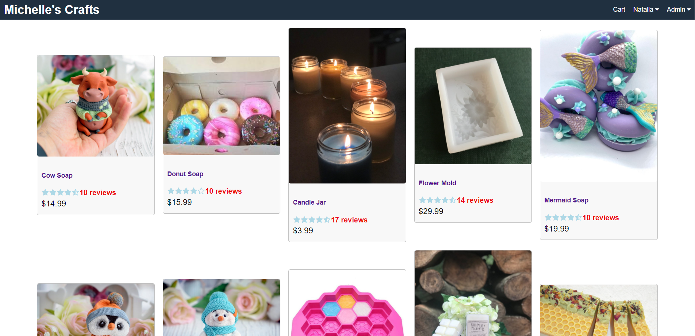

  #  Michelle's Crafts e-commerce 
  
  
  
  
  
  ## Description
    This is a template to generate a README.md file for projects  
    
  ## Table of Contents
  * [Installation](#installation)
  * [Usage](#usage)
  * [Demo](#demo)
  * [Credits](#credits)
  * [License](#license)
  * [Contributors](#contributors)
  * [Tests](#tests)
  * [Questions](#questions)
  
   ## Installation
     Steps to install the program are: cd backend npm install; cd frontend npm install; npm start from root 
 
   
  ## Usage
  Example and instrution of use: Fullstack MERN e-commerce SPA with user log in, profile update, ordering and shipping confirmation. Payment process sandbox Paypal and Credit Cards. Admin log in with product post, local storage image upload, product delete and edit, view or placed dorders, payments and shipping information 
  ## Demo
  

[Demo URL](https://mighty-sands-90705.herokuapp.com/)
  
  ## Credits
   Program collaborators and third party assets: No Collaborators used
  
 ## License
    MIT
  
  ## Contributors
   Quidelines to contributors: undefined

  ## Tests
   To test run the following code: No test 
  
    
  ## Questions
  
 GitHub Username: https://github.com/natka58 
  
E-mail: lilikoy@sbcglobal.net.